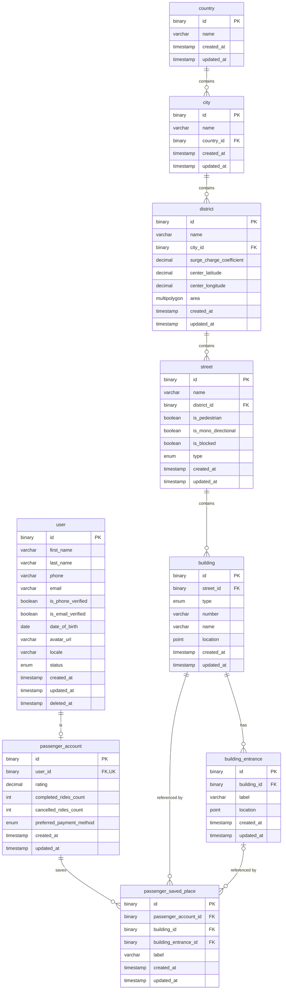

# Database Schema Documentation

Brief overview of the spatial and address schema designed for taxi/dispatch systems, including entity descriptions and an Entity-Relationship (ER) diagram.

---

### Entity Descriptions

- **`country`**: Top-level geographical entity representing sovereign countries.
- **`city`**: Cities located within a specific country (`country_id`).
- **`district`**: Administrative and operational city districts containing spatial boundaries (`area` polygon/multipolygon), center coordinates, and dynamic surge pricing multipliers (`surge_charge_coefficient`).
- **`street`**: Roadways and thoroughfares inside districts with traffic attributes (`is_pedestrian`, `is_mono_directional`, `is_blocked`, `type`).
- **`building`**: Specific buildings located on streets with building classification (`type`), postal number, name, and spatial GIS point (`location`).
- **`building_entrance`**: Specific pickup/dropoff entrances and gates for a building with precise coordinates (`location`) and descriptive labels.
- **`user`**: Generic identity shared by every app role: name, phone (E.164) and email unique among non-deleted users (functional unique indexes on `IF(deleted_at IS NULL, ...)`, so a deleted user's contacts can be reused), verification flags, locale, account `status` (`active`/`blocked`), and soft delete via `deleted_at`.
- **`passenger_account`**: Passenger-app profile, strictly one-to-one with `user` (`user_id` is `UNIQUE`, cascades on user delete). Holds rating, ride counters, and preferred payment method.
- **`passenger_saved_place`**: Named pickup/dropoff shortcuts of a passenger ("Home", "Work", "Gym"), one-to-many from `passenger_account`, each pinned to a `building` and optionally to an exact `building_entrance` (not every building has one; entrance delete falls back to the building). Label is unique per passenger.

---

### Entity-Relationship Diagram

