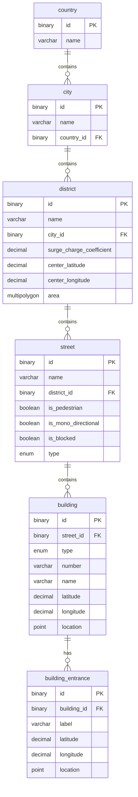

# Database Schema Documentation

Brief overview of the spatial and address schema designed for taxi/dispatch systems, including entity descriptions and an Entity-Relationship (ER) diagram.

---

### Entity Descriptions

- **`country`**: Top-level geographical entity representing sovereign countries.
- **`city`**: Cities located within a specific country (`country_id`).
- **`district`**: Administrative and operational city districts containing spatial boundaries (`area` polygon/multipolygon), center coordinates, and dynamic surge pricing multipliers (`surge_charge_coefficient`).
- **`street`**: Roadways and thoroughfares inside districts with traffic attributes (`is_pedestrian`, `is_mono_directional`, `is_blocked`, `type`).
- **`building`**: Specific buildings located on streets with building classification (`type`), postal number, name, decimal coordinates, and spatial GIS point (`location`).
- **`building_entrance`**: Specific pickup/dropoff entrances and gates for a building with precise coordinates (`location`) and descriptive labels.

---

### Entity-Relationship Diagram

